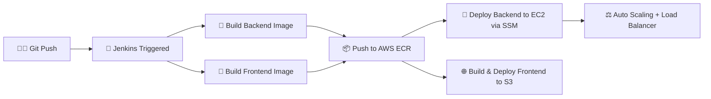

# 🏥 MediCare Hospital Management System

## System Architecture
### ✨ A complete hospital management solution for Sri Lanka ✨

---

## 🎥 Demo

**Feature Walkthrough Video:** [Watch on YouTube](https://youtu.be/oN8VSXBk8ek)

> The live AWS deployment below was fully built and tested during development, but is currently offline due to AWS free-tier limits being reached. The video above walks through the app's features and UI. The AWS infrastructure and Jenkins CI/CD pipeline are documented below.

---

## ☁️ AWS Infrastructure

| Service | Purpose |
|---------|---------|
| **EC2 (t3.micro)** | Backend Node.js server |
| **S3** | Frontend static website hosting |
| **ECR** | Docker image registry |
| **ALB** | Application Load Balancer |
| **Auto Scaling Group** | Scale EC2 instances (1-3) based on CPU |
| **IAM** | Roles and permissions |
| **SSM** | Remote deployment without SSH |
| **CloudFormation** | Infrastructure as Code |

## 🔄 CI/CD Pipeline

Fully automated, zero-downtime deployment pipeline triggered on every push to `main`:



| Stage | Action | Tooling |
|:---:|---|---|
| 1️⃣ | Push triggers Jenkins job automatically | GitHub Webhook → Jenkins |
| 2️⃣ | Parallel Docker builds for backend & frontend | Docker |
| 3️⃣ | Versioned images pushed to a private registry | AWS ECR |
| 4️⃣ | Backend redeployed to EC2 with no SSH access needed | AWS SSM |
| 5️⃣ | Frontend built and synced to static hosting | AWS S3 |
| 6️⃣ | Traffic auto-balanced across healthy instances | ALB + Auto Scaling Group |

**Result:** every merge to `main` ships to production automatically, with the Load Balancer and Auto Scaling Group keeping the app online during deploys — no manual steps, no downtime.

---

## 🌟 System Overview

### 🔍 Overview
The MediCare Hospital Management System is a full-stack platform that connects:
- 🧑‍⚕️ Doctors
- 🏥 Patients  
- 🛡️ Hospital Admin

### 🔗 Built with:
- **Frontend:** React.js ⚛️
- **Backend:** Node.js + Express.js 🟢
- **AI:** Groq API (LLaMA 3.3 70B) 🤖
- **DevOps:** Docker 🐳 + AWS ☁️ + Jenkins 🔧

| Component | Technology Stack | Key Features |
|-----------|-----------------|--------------|
| Frontend | React.js, Tailwind CSS | 🖥️ Responsive UI, 📊 Dashboards |
| Backend | Node.js, Express.js, MongoDB | 🔌 REST API, 🔒 JWT Auth |
| Real-time | Socket.io | 💬 Live Chat, 🔔 Notifications |
| AI | Groq API | 🤖 Symptom Checker, 🗣️ Chatbot |
| DevOps | Docker, AWS, Jenkins | 🐳 Containerization, ☁️ Cloud, 🔄 CI/CD |

---

## 🛠️ Core Features

### 🔐 Authentication Flow
**🔒 Security Features:**
- 🛡️ JWT token-based security
- ✉️ Email notifications via Gmail SMTP
- 👨‍💼 Role-based access control (Patient, Doctor, Admin)
- 🔄 Forgot password with secure reset link via email
- 🔔 Toast notifications with react-hot-toast
- 🚧 Rate limiting on auth endpoints
- 🪖 HTTP security headers with Helmet.js

---

### 🧑‍⚕️ Patient Portal
**🏥 Patient Features:**
- 🤖 AI-powered symptom checker with doctor recommendations
- 🔍 Browse and search doctors by specialization
- 📅 Book appointments with time slot validation
- 📋 Receive booking reference number and OTP via email
- 📄 View and download prescriptions as PDF
- 📜 View complete medical history
- 💬 Real-time chat with hospital admin
- 🖼️ Profile photo upload via Cloudinary
- ❌ Cancel pending appointments

---

### 👨‍⚕️ Doctor Portal
**🩺 Doctor Features:**
- 📝 Register with own credentials
- 🏥 Complete profile with specialization and fees in LKR
- 📅 Set available time slots per day
- ✅ Accept or reject patient appointments
- 💊 Write digital prescriptions with medicine details
- 📜 View patient medical history
- ✏️ Edit profile and availability anytime
- 💬 Real-time chat with hospital admin
- 🖼️ Profile photo upload via Cloudinary

---

### 🛡️ Admin Dashboard
**📊 Admin Features:**
- 📈 Dashboard with hospital statistics
- ✅ Approve or reject doctor registrations
- 👥 Manage all doctors and patients
- 📅 View all appointments with booking references
- 💬 Real-time chat with doctors and patients
- 📧 Email notifications for all approval actions
- 🗑️ Delete doctor and patient accounts

---

### 🤖 AI Features
**🧠 Powered by Groq API (LLaMA 3.3 70B):**
- 🔍 AI symptom checker with specialist recommendations
- 🚨 Shows urgency level (Low, Medium, High)
- 💊 Lists possible conditions based on symptoms
- 🗣️ 24/7 AI chatbot for hospital queries
- 📍 Hospital info, services and booking guidance

---

### 📧 Email Features
**✉️ Email Notifications:**
- 👋 Welcome email on registration
- 🔐 Login notification with date and time
- 📋 Appointment confirmation with OTP and booking reference
- ✅ Appointment status updates (confirmed, cancelled)
- ⏰ Automated reminder 1 hour before appointment
- 👨‍⚕️ Doctor approval or rejection notification
- 🔑 Password reset link (valid 30 minutes)

---

### 💬 Real-time Chat
**🔌 Socket.io Features:**
- 💬 Real-time messaging between Admin and Doctors
- 💬 Real-time messaging between Admin and Patients
- 🟢 Online or offline status indicator
- ✍️ Typing indicator
- ✓✓ Message seen or unseen indicator
- 🔔 New message toast notification
- 📬 Unread message badge count

---

### 📄 Prescription Management
**💊 Prescription Features:**
- 👨‍⚕️ Doctor writes digital prescription after appointment
- 💊 Add multiple medicines with dosage and frequency
- 📝 Diagnosis and additional notes
- 📅 Follow-up date scheduling
- 📥 Patient downloads prescription as professional PDF
- 🏥 MediCare branded PDF with hospital details

---

### 📜 Medical History
**🏥 History Features:**
- 📊 Complete stats (total visits, prescriptions, doctors)
- 📅 All appointments with status history
- 💊 All prescriptions in one place
- 👨‍⚕️ All doctors visited with book again option
- 📈 Overview, appointments, prescriptions and doctors tabs

---

## ⚙️ Technical Highlights
- 🎨 Modern UI with Tailwind CSS
- 🎯 Icon set using React Icons
- 📄 PDF generation with jsPDF
- 🔄 API communication via Axios
- ☁️ Image storage on Cloudinary
- ✉️ Email services via Gmail SMTP
- ⏰ Scheduled tasks with node-cron
- 🐳 Docker containerization
- 🔒 bcrypt password hashing (10 rounds)

---

## ⚙️ Prerequisites
- 💻 Node.js (v18+)
- 🐳 Docker Desktop
- ☁️ MongoDB Atlas account
- 🖼️ Cloudinary account
- 🤖 Groq API account
- ✉️ Gmail account with App Password

---

## 🚀 Installation

```bash
git clone https://github.com/abinash1417/Hospital-app.git
cd Hospital-app
```

**Backend Setup:**
```bash
cd backend
npm install
npm run seed
npm run dev
```

**Frontend Setup:**
```bash
cd frontend
npm install
npm run dev
```

**Docker:**
```bash
docker-compose up --build
```

---

## 🔒 Security Features
- 🔐 JWT token authentication (30 day expiry)
- 🚧 Role-based protected routes
- 🔄 Secure password recovery with email reset link
- ✅ Input validation on all forms
- 🚦 Rate limiting on authentication endpoints
- 🪖 HTTP security headers with Helmet.js
- 🔑 bcrypt password hashing
- 🚫 Admin registration blocked through API

---

## 🚀 Future Enhancements
- 📲 Push notifications
- 📈 Advanced analytics for admin
- 💳 Online payment integration (PayHere Sri Lanka)
- 📹 Video consultation with WebRTC
- 🌍 Sinhala and Tamil language support
- ⭐ Doctor rating and review system

---
